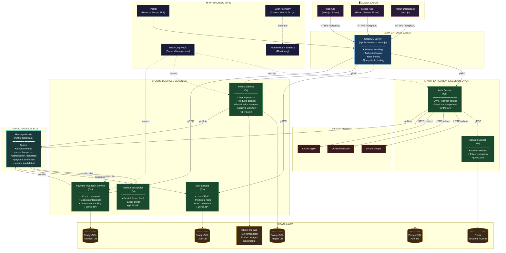

# 🚢 Import Container Management System

> **Enterprise-grade microservices backend** for managing container import projects, investor participation, and crypto-based payments via Gapcoin.

---

## 📋 Table of Contents

- [Overview](#-overview)
- [Architecture Diagram](#-architecture-diagram)
- [Services](#-services)
- [Tech Stack](#-tech-stack)
- [Communication Patterns](#-communication-patterns)
- [Project Lifecycle](#-project-lifecycle)
- [Data Flow](#-data-flow)
- [Security](#-security)
- [Directory Structure](#-directory-structure)
- [Getting Started](#-getting-started)

---

## 🎯 Overview

This system manages the full lifecycle of container import projects — from creation by a project owner, through investor participation and Gapcoin-based funding, to administrative approval and logistics tracking.

**Key roles:**

| Role | Responsibilities |
|------|-----------------|
| **Owner** | Creates and publishes import projects, manages product catalog, accepts/rejects investor participation requests |
| **Investor** | Browses published projects, requests participation (products or profit-share), pays via Gapcoin |
| **Admin** | Reviews fully-funded projects, approves them for execution, manages logistics data |

**Core design principles:**
- **Domain-Driven Design (DDD)** — each service owns its bounded context
- **CQRS** — read/write separation in high-traffic services
- **Event-driven** — async decoupling via NATS JetStream
- **Zero Trust** — mTLS between all internal services
- **Observability-first** — distributed tracing from day one (OpenTelemetry)

---

## 🗺️ Architecture Diagram



---

## ⚙️ Services

### 🔀 GraphQL API Gateway — `Apollo Server (Node.js/TypeScript)`
The **sole public entry point** of the system. No client ever communicates directly with internal microservices.

- Schema-first GraphQL with schema stitching across domains
- JWT validation middleware on every resolver
- DataLoader pattern to prevent N+1 query problems
- Rate limiting: `100 req/min` (anonymous), `1000 req/min` (authenticated)
- Query depth and complexity limiting to prevent DoS via query abuse

---

### 🔐 Auth Service — `Go`
Handles identity verification and token issuance.

- **OAuth 2.0** flows: Google, Facebook, Apple
- Issues **JWT RS256** access tokens (15 min TTL) and refresh tokens (7 days, rotating)
- Public key exposed via **JWKS endpoint** for stateless validation by the gateway
- Publishes `session.invalidated` events on logout

---

### 🎫 Session Service — `Go + Redis`
Manages active session state independently from token issuance.

- Stores session metadata in Redis hashes with TTL
- Supports **logout-all-devices** via user-indexed session sets
- Token revocation in O(1) via Redis
- Subscribed to `session.invalidated` events for cross-device logout propagation

---

### 👤 User Service — `Go`
Owns all user profile data.

- User CRUD: name, email, photo URL, phone
- **RBAC roles**: `OWNER`, `INVESTOR`, `ADMIN`
- KYC status tracking
- Subscribes to `payment.confirmed` to update investor history

---

### 📦 Project Service — `Go`
The **core business service**. Owns the entire import project domain.

- Full **ImportProject** lifecycle management (see [Project Lifecycle](#-project-lifecycle))
- **Product catalog** per project: name, description, unit of measure, quantity, unit price, supplier data, S3-linked photos
- **ParticipationRequest** management: type `PRODUCTS` or `PROFIT`, owner accept/reject flow
- Exporter data, shipping costs (freight, transport, layovers, international fees) stored as JSONB
- Auto-transitions to `PENDING_ADMIN_APPROVAL` when funding reaches 100%
- Publishes events: `project.created`, `project.published`, `project.approved`, `participation.requested`, `participation.approved`

---

### 💳 Payment Service — `Go`
Handles all financial operations with full audit guarantees.

- **Gapcoin** crypto payment integration
- Idempotency keys (`X-Idempotency-Key` header) stored in Redis for 24h to prevent double-processing
- Append-only audit log in PostgreSQL (trigger-enforced)
- Publishes `payment.confirmed` → consumed by Project Service to update `funded_amount`

---

### 🔔 Notification Service — `Go`
Pure event consumer. Sends notifications across channels.

- Multi-channel: **Email / Push / SMS**
- Subscribes to: `participation.requested`, `participation.approved`, `project.approved`, `payment.confirmed`
- Zero direct gRPC calls — fully decoupled, driven by events

---

## 🛠️ Tech Stack

| Layer | Technology | Rationale |
|-------|-----------|-----------|
| API Gateway | Apollo Server (Node.js/TS) | Mature GraphQL ecosystem, schema-first, native DataLoader |
| All microservices | **Go** | Low memory footprint, native concurrency, fast cold starts, single binary deployments |
| Inter-service (sync) | **gRPC + Protobuf** | Typed contracts, binary serialization 5–10× faster than REST/JSON, bidirectional streaming |
| Inter-service (async) | **NATS JetStream** | Persistent messaging, at-least-once delivery, event replay, lower ops overhead than Kafka at this scale |
| Databases | **PostgreSQL** | ACID, JSONB for flexible metadata, Row-Level Security for multi-tenancy |
| Cache / Sessions | **Redis 7** | O(1) session ops, sliding-window rate limiting, Pub/Sub for cache invalidation |
| Object Storage | **MinIO (S3-compatible)** | Product images and project documents, presigned URLs, self-hosted |
| Secrets | **HashiCorp Vault** | Auto-rotating DB credentials, internal PKI for mTLS certs |
| Observability | **OpenTelemetry → Grafana** | Distributed traces, RED metrics, structured logs (zerolog) |
| Reverse Proxy | **Traefik v3** | Automatic TLS (ACME), circuit breakers, auth middlewares |

---

## 📡 Communication Patterns

### Synchronous — gRPC

All request/response interactions use gRPC with strongly-typed Protobuf contracts. Proto definitions live in a shared `proto/` git submodule.

Every message includes traceability fields:
```protobuf
message RequestMetadata {
  string trace_id    = 1;
  string span_id     = 2;
  string request_id  = 3;
  string source_svc  = 4;
}
```

### Asynchronous — NATS JetStream

Event naming convention: `{domain}.{entity}.{action}`

| Topic | Publisher | Subscribers | Purpose |
|-------|-----------|-------------|---------|
| `project.published` | Project Svc | Notification Svc | Notify investors |
| `participation.requested` | Project Svc | Notification Svc | Notify project owner |
| `participation.approved` | Project Svc | Notification Svc, Payment Svc | Unlock payment flow |
| `payment.confirmed` | Payment Svc | Project Svc, Notification Svc | Update funded amount |
| `project.approved` | Project Svc | Notification Svc | Notify all participants |
| `session.invalidated` | Auth Svc | Session Svc | Cross-device logout |

All events carry: `event_id` (UUID v7), `occurred_at`, `correlation_id`, `source_service`, `schema_version`.

---

## 🔄 Project Lifecycle

```
DRAFT → PUBLISHED → FUNDING → FULLY_FUNDED → PENDING_ADMIN_APPROVAL → APPROVED → IN_TRANSIT → COMPLETED
                                                                           ↓
                                                                       CANCELLED
                                                     EXPIRED ←── (cron job on expiry_date)
```

| State | Description | Trigger |
|-------|-------------|---------|
| `DRAFT` | Created, not visible to investors | Owner creates project |
| `PUBLISHED` | Visible, accepting participation requests | Owner publishes |
| `FUNDING` | Participation approved, receiving payments | First request approved |
| `FULLY_FUNDED` | 100% of product cost covered | `payment.confirmed` reaches 100% |
| `PENDING_ADMIN_APPROVAL` | Awaiting admin review | Auto on `FULLY_FUNDED` |
| `APPROVED` | Admin approved, ready for execution | Admin approves |
| `IN_TRANSIT` | Container dispatched | Admin registers shipment |
| `COMPLETED` | Received, distributions processed | Admin marks complete |
| `CANCELLED` | Cancelled, refunds processed | Owner or Admin |
| `EXPIRED` | Expiry date reached without full funding | Daily cron job |

State transitions are **enforced at the domain layer** — invalid transitions throw a domain error before any DB write occurs.

---

## 🔁 Data Flow

**Happy path: Investor funds a project**

```
Investor → GraphQL (mutation: requestParticipation)
         → Project Service (gRPC: RequestParticipation)
         → DB: ParticipationRequest{status: PENDING}
         → NATS publish: participation.requested
         → Notification Service → Email to Owner

Owner → GraphQL (mutation: approveParticipation)
      → Project Service (gRPC: ApproveParticipation)
      → DB: ParticipationRequest{status: APPROVED}
      → NATS publish: participation.approved

Investor → GraphQL (mutation: initiatePayment)
         → Payment Service (gRPC: InitiatePayment)
         → Gapcoin API → TX confirmed
         → DB: Payment{status: CONFIRMED}
         → NATS publish: payment.confirmed

Project Service (subscriber: payment.confirmed)
      → UPDATE projects SET funded_amount = funded_amount + X
      → IF funded_amount >= total_cost → status = PENDING_ADMIN_APPROVAL
      → NATS publish: project.fully_funded
```

---

## 🔒 Security

| Mechanism | Implementation | Scope |
|-----------|---------------|-------|
| **JWT RS256** | Access token 15 min / Refresh token 7 days (rotating). RSA 4096. JWKS endpoint | Auth Service |
| **mTLS** | Vault PKI issues certs for all services. All inter-service traffic mutually authenticated | All services |
| **Rate Limiting** | Sliding window in Redis. Per IP + per `user_id` | GraphQL Gateway |
| **Row-Level Security** | PostgreSQL RLS policies. Investors see only their own participations | Project DB, User DB |
| **Idempotency Keys** | `X-Idempotency-Key` stored in Redis 24h. Prevents double payment processing | Payment Service |
| **Input Validation** | Layer 1: `protoc-gen-validate` on proto fields. Layer 2: domain invariants in Go | All services |
| **Secret Rotation** | Vault dynamic secrets rotate DB passwords every 30 days, zero downtime | HashiCorp Vault |
| **Audit Log** | Append-only PostgreSQL table with triggers. Immutable record of all financial ops | Payment + Project DB |

---

## 🗂️ Directory Structure

Each Go microservice follows **hexagonal architecture** (Ports & Adapters):

```
/{service-name}/
├── cmd/
│   └── server/          # main.go — dependency wiring (wire)
├── internal/
│   ├── domain/          # Entities, Value Objects, Domain Events, Repository interfaces
│   ├── application/     # Use Cases: Commands + Queries (CQRS)
│   ├── infrastructure/  # Repository impl (pgx), Redis client, external API clients
│   └── transport/
│       └── grpc/        # Proto handlers, interceptors (auth, tracing, recovery)
├── pkg/                 # Shared: logger (zerolog), tracer, error types
├── proto/               # .proto definitions (git submodule → shared across services)
├── migrations/          # SQL migrations (goose)
├── Dockerfile
└── docker-compose.yml
```

```
/proto/                  # Shared git submodule
├── auth/v1/
├── user/v1/
├── project/v1/
└── payment/v1/
```

---

## 🚀 Getting Started

### Prerequisites

- Go `1.23+`
- Docker & Docker Compose
- `protoc` + `protoc-gen-go` + `protoc-gen-go-grpc`
- Node.js `20+` (for GraphQL gateway)

### Run locally

```bash
# Clone the repo
git clone https://github.com/your-org/import-container-system.git
cd import-container-system

# Start infrastructure (Postgres, Redis, NATS, MinIO, Vault)
docker compose -f docker-compose.infra.yml up -d

# Generate proto bindings
make proto-gen

# Run all services
make dev

# GraphQL Playground available at:
# http://localhost:4000/graphql
```

### Environment variables

Each service reads its config from environment variables (or Vault). Copy the example:

```bash
cp .env.example .env
# Edit with your Gapcoin API credentials, OAuth client IDs, etc.
```

---

## 📄 License

MIT © Your Organization
